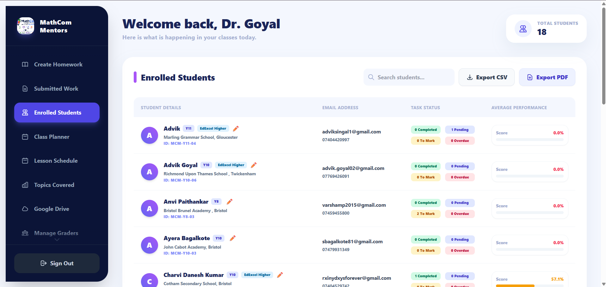
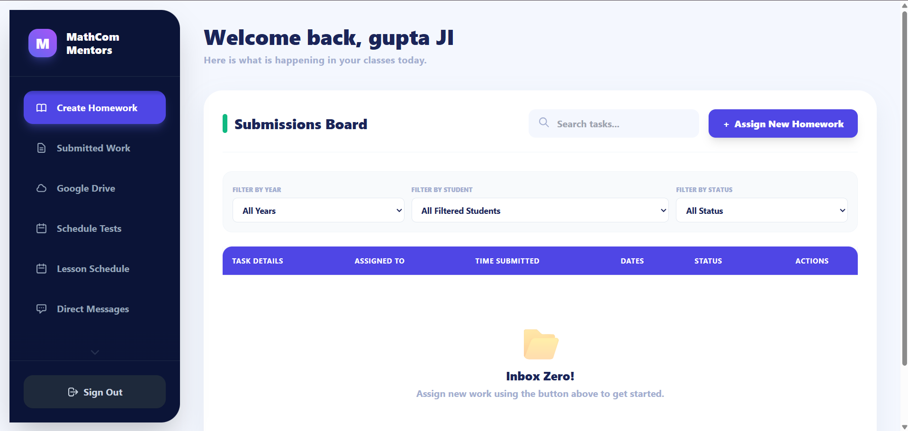
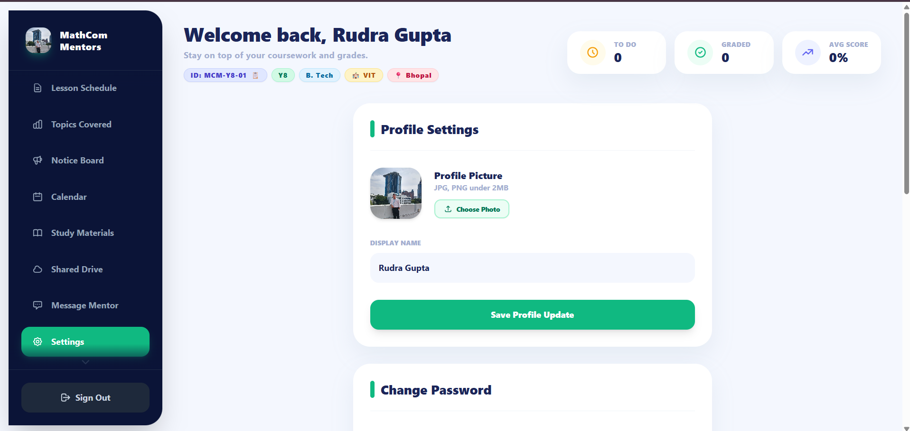
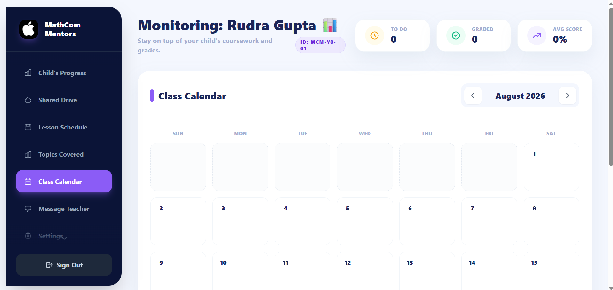
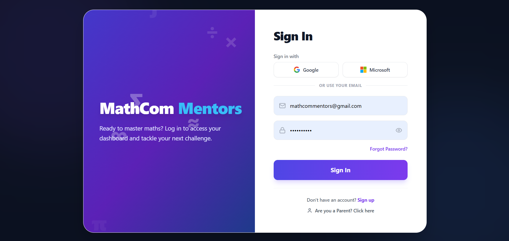
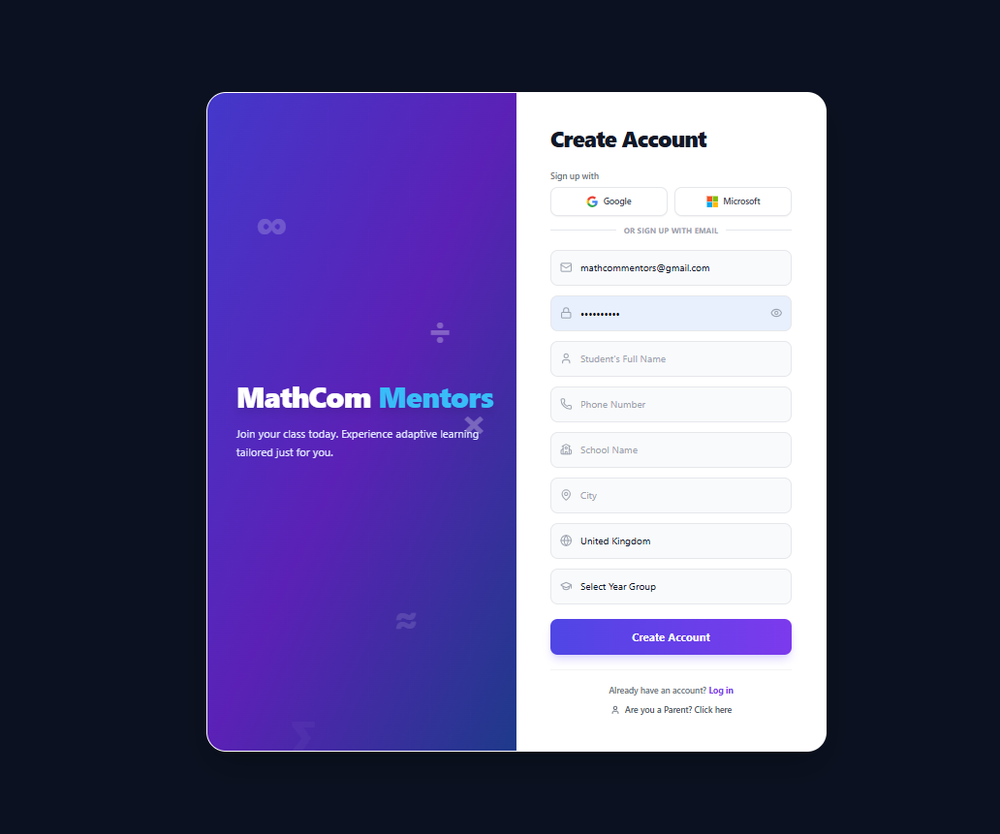
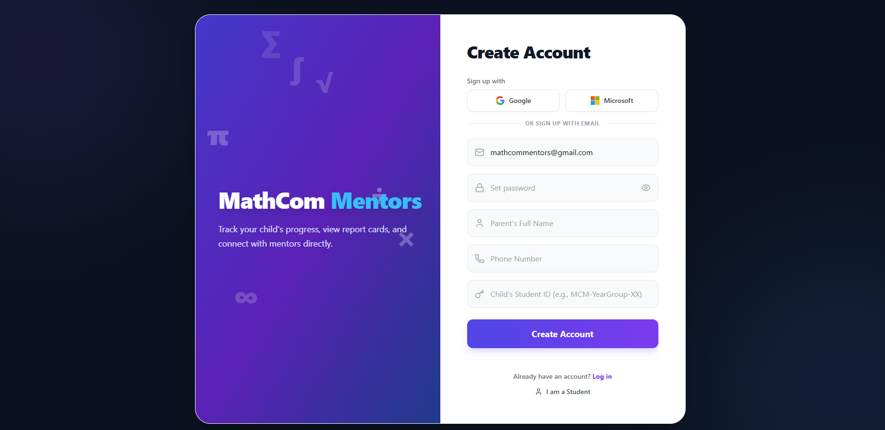
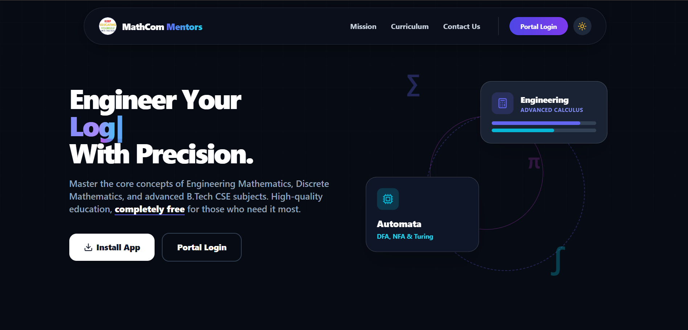

# 🎓 MathCom Mentors | Classroom Portal

MathCom Mentors is a full-stack MERN educational platform built to centralize the digital classroom. It provides secure, role-based dashboards for teachers, students, graders and parents to manage assignments, track academic progress and streamline communication in one place.

[](https://mathcommentors.com/)
[](https://reactjs.org/)
[](https://nodejs.org/)
[](https://www.mongodb.com/)
[](https://expressjs.com/)
[](https://tailwindcss.com/)
[](https://aws.amazon.com/s3/)
[](https://aws.amazon.com/cloudfront/)

**🚀 Live Platform:** [https://mathcommentors.com/](https://mathcommentors.com/)  
**🔐 Direct Login Portal:** [https://mathcommentors.com/login](https://mathcommentors.com/login)

---
## 📱 Download / Install the App (PWA)

MathCom Mentors is a **Progressive Web App (PWA)**, meaning you can install it directly to your phone or computer for a seamless, native app experience!

**To install the app, go to [mathcommentors.com](https://mathcommentors.com/) and follow these steps:**

*   **For iOS (iPhone/iPad):** Open the site in **Safari**, tap the **Share** icon at the bottom of the screen, and select **"Add to Home Screen"**.
*   **For Android:** Open the site in **Chrome**. A banner will appear at the bottom—simply tap **"Add MathCom Mentors to Home screen"**. (Alternatively, tap the 3 dots in the top right and select "Install app").
*   **For Desktop (Windows/Mac):** Open the site in **Chrome or Edge**. Click the small **Install icon** (a computer screen with a downward arrow) located on the far right side of your URL address bar.

---

## 🌟 Comprehensive Feature Breakdown

| Category | Feature | Description | Accessible Roles |
| :--- | :--- | :--- | :--- |
| **Security & Auth** | **Social OAuth Integration** | Seamless, one-click "Sign in with Google" and "Sign in with Microsoft" functionality utilizing secure Progressive Profiling. | All Users |
| | **Role-Based Access (RBAC)** | Strict access control ensuring users only see dashboards and data relevant to their specific role. | All Users |
| | **JWT Authentication** | Secure, stateless session management and protected API endpoints using JSON Web Tokens. | All Users |
| | **Secure Password Recovery** | Automated email system using Nodemailer to send encrypted password reset links for local accounts. | All Users |
| **Dashboards** | **Admin Control Center** | Complete system oversight, user account creation/management, and platform-wide configuration. | Admin |
| | **Teacher Workspace** | Hub for creating classes, tracking syllabus progress, and monitoring overall class performance. | Teacher |
| | **Student Portal** | Personalized view of pending tasks, submitted work, grades, and upcoming deadlines. | Student |
| | **Parent Hub** | Real-time tracking of their child's attendance, grades, and teacher feedback. | Parent |
| | **Grader Interface** | Dedicated pipeline for reviewing submissions, assigning marks, and writing feedback. | Grader |
| **Academic Tools** | **Homework Management** | End-to-end system to create, distribute, submit, and evaluate digital assignments. | Teacher, Student, Grader |
| | **Cloud Resource Library** | Secure, scalable centralized repository powered by AWS S3 and accelerated by AWS CloudFront for lightning-fast global delivery of study materials, PDFs, and media. | Teacher, Student |
| | **Class Planner & Scheme** | Tools to map out the curriculum, schedule upcoming lessons, and track syllabus completion. | Admin, Teacher |
| | **Topic Progress Tracking** | Granular tracking of student and class progress through specific curriculum topics. | Teacher, Student, Parent |
| **Communication** | **Contextual Feedback** | Attach specific, constructive comments directly to a student's graded submission. | Teacher, Grader, Student |
| | **Contact & Support** | Streamlined contact routing for platform support and administrative inquiries. | All Users |
| | **Internal Messaging** | Secure direct communication channel connecting educators with parents. | Teacher, Parent |
| **Automation** | **CRON Job Reminders** | Background server tasks that automatically detect approaching deadlines and send warning emails. | Student, Parent |
| | **Automated Alerts** | Instant email notifications triggered by new assignments or newly published grades. | Student, Parent |

## 🎭 User Roles & Dashboards

| Role | Capabilities & Access |
| :--- | :--- |
| **👨‍🏫 Teacher/Admin** | Creates classes, assigns homework, uploads study materials, publishes announcements, monitors student performance, and communicates with parents. |
| **📝 Grader** | Reviews and grades student submissions, provides constructive feedback, and tracks overall assignment completion rates. |
| **🎓 Student** | Views upcoming assignments, submits homework, accesses study resources, checks grades, tracks personal academic progress, and receives automated reminders. |
| **👪 Parent** | Monitors their child’s attendance, grades, homework status, teacher feedback, and overall academic performance in real-time. |

---

## 🖼️ Website Images

<table border="1" align="center">
  <tr>
    <td align="center">
      <b>Admin Dashboard</b><br>
      
    </td>
    <td align="center">
      <b>Grader Interface</b><br>
      
    </td>
  </tr>
  <tr>
    <td align="center">
      <b>Student Portal</b><br>
      
    </td>
    <td align="center">
      <b>Parent Hub</b><br>
      
    </td>
  </tr>
  <tr>
    <td align="center">
      <b>Login Screen</b><br>
      
    </td>
    <td align="center">
      <b>Student Sign Up</b><br>
      
    </td>
  </tr>
  <tr>
    <td align="center">
      <b>Parent Sign Up</b><br>
      
    </td>
    <td align="center">
      <b>Landing / Home Page</b><br>
      
    </td>
  </tr>
</table>

---

## 🛠️ Technology Stack

### **Frontend**
- **React.js** (UI Development)
- **Vite** (Next-generation frontend tooling)
- **Tailwind CSS** (Utility-first styling)
- **React Router DOM** (Application routing)
- **Axios** (API communication)
- **Framer Motion** (Smooth UI animations)
- **@react-oauth/google & @azure/msal-react** (Social Authentication)

### **Backend**
- **Node.js & Express.js** (Server & API architecture)
- **MongoDB & Mongoose** (Database & Object Data Modeling)
- **AWS S3 & CloudFront** (Secure cloud object storage integration with globally accelerated CDN delivery)
- **JSON Web Tokens (JWT)** (Authentication)
- **Bcrypt.js** (Password hashing)
- **Nodemailer** (Email integration)
- **Node-Cron** (Automated background tasks)

---

# 📂 Exact Project Structure

## Frontend: React Client App

The `client/` directory contains the Vite-powered React application with Tailwind CSS for styling.

```text
client/
├── package.json
├── vite.config.js
├── tailwind.config.js
├── postcss.config.js
├── eslint.config.js
├── index.html
├── public/
│   └── mathcom-logo.png
└── src/
    ├── main.jsx
    ├── App.jsx
    ├── index.css
    ├── App.css
    ├── services/
    │   └── api.js
    ├── context/
    │   └── AuthContext.jsx
    ├── components/
    │   ├── common/
    │   │   └── ProtectedRoute.jsx
    │   └── admin/
    │       ├── AssignHomework.jsx
    │       └── UploadQuestion.jsx
    └── pages/
        ├── auth/
        │   └── AuthPage.jsx
        ├── home/
        │   └── HomePage.jsx
        ├── admin/
        │   └── AdminDashboard.jsx
        ├── student/
        │   └── StudentDashboard.jsx
        └── parent/
            └── ParentDashboard.jsx
```
## Backend: Node/Express Server

The `server/` directory contains the REST API architecture, database models, and business logic.

```text
server/
├── server.js
├── package.json
├── config/
│   └── db.js
├── models/
│   ├── Announcement.js
│   ├── Assignment.js
│   ├── DriveLink.js
│   ├── Homework.js
│   ├── Message.js
│   ├── Question.js
│   ├── Resource.js
│   ├── Scheme.js
│   └── User.js
├── controllers/
│   ├── adminController.js
│   ├── announcementController.js
│   ├── authController.js
│   ├── driveController.js
│   ├── homeworkController.js
│   ├── messageController.js
│   ├── parentController.js
│   ├── resourceController.js
│   ├── schemeController.js
│   └── studentController.js
├── routes/
│   ├── adminRoutes.js
│   ├── announcementRoutes.js
│   ├── authRoutes.js
│   ├── driveRoutes.js
│   ├── homeworkRoutes.js
│   ├── messageRoutes.js
│   ├── parentRoutes.js
│   ├── resourceRoutes.js
│   ├── uploadRoutes.js
│   ├── schemeRoutes.js
│   └── studentRoutes.js
├── middlewares/
│   ├── authMiddleware.js
│   └── roleMiddleware.js
├── jobs/
│   └── reminderJob.js
└── utils/
    ├── s3Utils.js
    └── sendEmail.js
```

## ☁️ Deployment Architecture

* **Frontend:** Hosted on [Render](https://render.com/) for fast, continuous delivery from the repository.
* **Backend:** Deployed on [Render](https://render.com/), providing a reliable environment for the Node.js/Express REST API.
* **Database:** Hosted securely on MongoDB Atlas.
* **Storage:** AWS S3 buckets used for secure file storage, cached and distributed globally via AWS CloudFront.

# 🚀 Installation & Run Instructions

Follow these steps to get the application running on your local machine.

---

## 1. Clone the Repository

```bash
git clone https://github.com/rudragupta23/teacher-student-portal.git
cd Teacher-Student-Portal
```

---

## 2. Backend Setup

Navigate to the `server` directory, install dependencies, and start the development server.

```bash
cd server

# Install backend dependencies
npm install

# Start the development server
node server.js
```

The Express backend server will typically run on:

```
http://localhost:5000
```

---

## 3. Frontend Setup

Open a **new terminal**, navigate to the `client` directory, install dependencies, and start the Vite development server.

```bash
cd client

# Install frontend dependencies
npm install

# Start the Vite development server
npm run dev
```

The React frontend will typically run on:

```
http://localhost:5173
```

## 👤 Author

**Rudra Gupta**
* Portfolio: [rudraguptaportfolio.live](https://rudraguptaportfolio.live)
* LinkedIn: [@rudrag23](https://linkedin.com/in/rudrag23)
* GitHub: [@Rudragupta23](https://github.com/Rudragupta23)
* Email: 23rudragupta@gmail.com

---

# 📄 License

This project is intended for educational purposes.

